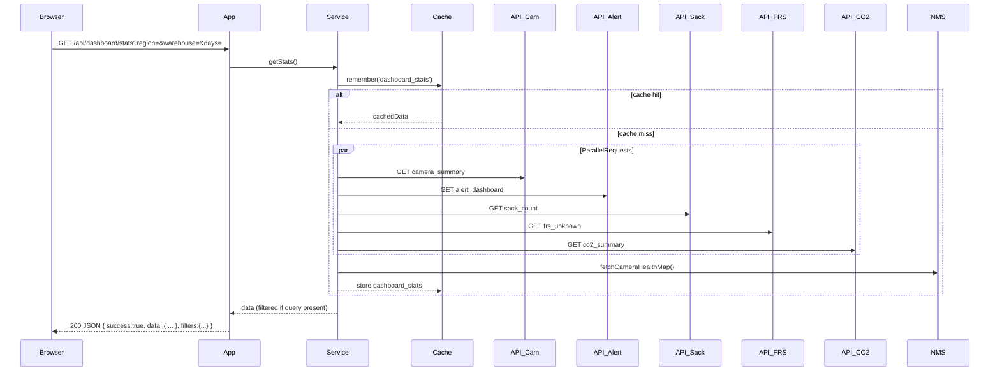
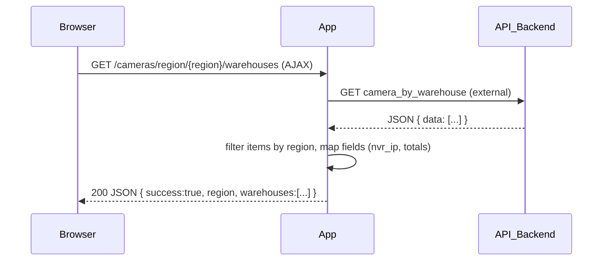
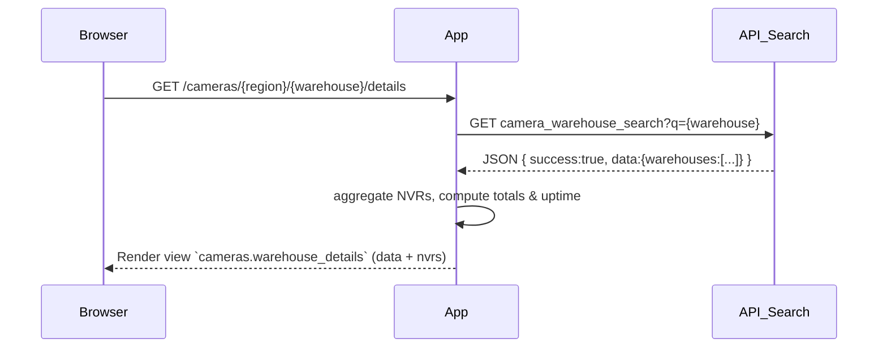
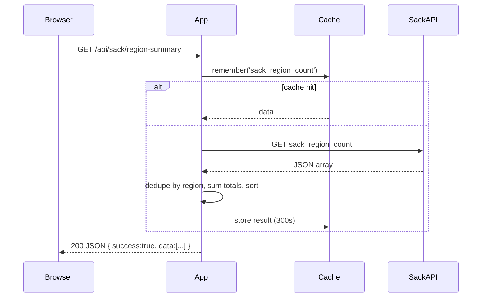

Software Requirements Specification (SRS) — cwc-app

Date: 2026-05-22

Overview

Purpose
- `cwc-app` is a Laravel-based dashboard for CCTV/IOT monitoring (camera health, alerts, CO2/PH3, sack-counting, FRS). It aggregates external APIs, provides RBAC, and exposes AJAX/API endpoints for the frontend.

Repository references
- routes: routes/web.php, routes/api.php
- dashboard API: app/Http/Controllers/Api/DashboardApiController.php
- dashboard service: app/Services/DashboardService.php
- IoT dropdowns: app/Http/Controllers/IotDropdownController.php
- Sack controller: app/Http/Controllers/SackController.php
- Camera endpoints: app/Http/Controllers/CameraController.php, app/Http/Controllers/RegionWarehousesController.php
- Models: app/Models/User.php, app/Models/Region.php, app/Models/Warehouse.php
- External API config: config/external-apis.php

Actors / Roles
- SuperAdmin
- Admin
- Region Officer (RO)
- Warehouse Officer (WO)
- Authenticated User
- External APIs (camera, alert, sack, frs, nms)

High-level Functional Requirements
- Dashboard: aggregated stats (camera totals, alert counts, CO2/PH3, sack counts, FRS).
- Camera network: list warehouses per region, warehouse details (NVRs, camera counts).
- Alerts: CO2/PH3 + fire/smoke/rodent reports with filters and pagination.
- Sack counting: region summary and detailed logs.
- FRS: unknown-person counts and region/warehouse selection.
- Region & Warehouse CRUD (RBAC-protected) and User management (superadmin).
- Theme toggle and profile management.
- Caching for external data and manual refresh endpoint.

Data Model (key entities)
- User: fields `name`, `email`, `password`, `region_id`, `warehouse_id`; relations `region()`, `warehouse()`; methods `getAccessibleWarehouses()`, `getAccessibleWarehouseNames()`, role checks.
- Region: `id`, `name`, hasMany `warehouses`.
- Warehouse: `id`, `warehouse` (name), `region_id`.

External Integrations
- Camera APIs: camera_summary, camera_by_region, camera_by_warehouse, camera_warehouse_search
- Alert APIs: co2_summary, alert_dashboard, master_alerts
- Sack & FRS: sack_base, sack_region_count, frs_base, frs_unknown
- Cavisson NMS: fetchCameraHealthMap used to build `mapData`
- Configured in `config/external-apis.php` with timeouts and cache TTLs.

API Reference (implemented endpoints)

1) GET `/api/dashboard/stats`
- Auth: session or `auth:sanctum` (depends on route group). 
- Query parameters: `region` (string), `warehouse` (string), `days` (int, default 30)
- Success response: JSON: `{ success: true, data: { /* keys below */ }, filters: { region, warehouse, days } }`
- `data` keys (from DashboardService::fetchAllStats):
  - `cameraTotal`, `cameraOnline`, `cameraOffline`
  - `fireDetected`, `smokeDetected`, `rodentDetected`
  - `fireWarehouses`, `smokeWarehouses`, `rodentWarehouses`
  - `fireLastSeen`, `smokeLastSeen`, `rodentLastSeen`
  - `topFireWarehouses`, `topSmokeWarehouses`, `topRodentWarehouses` (arrays)
  - `locationWise` (array of {locationName, state, fire, smoke, rodent})
  - `co2Severe`, `co2Critical`, `ph3Severe`, `ph3Critical`, `co2SensorTotal`, `ph3SensorTotal`
  - `sackIn`, `sackOut`, `sackNet`
  - `frsUnknown`, `frsCameraTotal`
  - `regionData` (array per region: {region, total_cameras, online_cameras, offline_cameras, online_percent, status})
  - `mapData` (array of markers: {area, state, city, status, lat, lng})
- Errors: 500 with `{success:false, message, error}`.

2) POST `/api/dashboard/refresh`
- Auth: same as stats.
- Description: clears cache and returns fresh stats (same data shape).
- Response: `{success:true, data: { ... }}` or error 500.

3) GET `/api/warehouses` or DashboardApiController::getWarehouses
- Query param: `region` (required)
- Missing region: 400 `{success:false, message:'Region parameter is required'}`
- Success: `{success:true, data:[{id,name},...], region: <region>}`

4) GET `/cameras/region/{region}/warehouses`
- Returns AJAX JSON: `{ success:true, region, warehouses:[{warehouse,nvr_ip,total_cameras,online_cameras,offline_cameras,online_percent,status,nvr_reachable}], count }`.
- Filters by region case-insensitive.

5) GET `/cameras/{region}/{warehouse}/details`
- Returns view `cameras.warehouse_details` with aggregated warehouse data and `nvrs` list.

6) GET `/iot/sack/regions`, `/iot/sack/warehouses` and `/iot/frs/regions`, `/iot/frs/warehouses`
- Return JSON arrays proxied from external services; results filtered by user role when applicable.

7) GET `/api/sack/region-summary`
- Returns cached aggregated sack region counts: `{ success:true, data:[{region,total_in_bags,total_out_bags,net_bags,last_action_at},...]}`.
- Cache TTL 300s. On failure returns `{success:false,data:[],error}`.

8) Alerts endpoints (web views + AJAX)
- `/alerts` (index), `/alerts/fetch`, `/alerts/locations/{state}` — use MasterAlertService; role filtering applied.

Error handling conventions
- Controllers log external API errors and often return empty arrays or `{success:false}` with 500.
- Role-based filtering enforced server-side where needed.

Diagrams

Use Case Diagram

```mermaid
actor SuperAdmin
actor Admin
actor RegionOfficer
actor WarehouseOfficer
actor AuthenticatedUser
actor ExternalAPI

usecase UC_Dash as "View Dashboard\n(aggregate stats)"
usecase UC_Refresh as "Refresh Dashboard\n(force refresh)"
usecase UC_RegionWH as "List Region Warehouses\n(AJAX)"
usecase UC_WHDetails as "View Warehouse Details"
usecase UC_Alerts as "View & Filter Alerts"
usecase UC_SackSummary as "View Sack Region Summary"
usecase UC_FRS as "Fetch FRS Regions/Warehouses"
usecase UC_ManageUsers as "Manage Users (CRUD)"
usecase UC_ManageMasters as "Manage Regions/Warehouses"

SuperAdmin --> UC_Dash
SuperAdmin --> UC_Refresh
SuperAdmin --> UC_ManageUsers
SuperAdmin --> UC_ManageMasters

Admin --> UC_Dash
Admin --> UC_Alerts
Admin --> UC_SackSummary

RegionOfficer --> UC_Dash
RegionOfficer --> UC_RegionWH
RegionOfficer --> UC_WHDetails
RegionOfficer --> UC_Alerts
RegionOfficer --> UC_SackSummary

WarehouseOfficer --> UC_Dash
WarehouseOfficer --> UC_WHDetails
WarehouseOfficer --> UC_Alerts

AuthenticatedUser --> UC_Dash
AuthenticatedUser --> UC_FRS

ExternalAPI ..> UC_Dash
ExternalAPI ..> UC_RegionWH
ExternalAPI ..> UC_WHDetails
ExternalAPI ..> UC_SackSummary
ExternalAPI ..> UC_FRS
```

Sequence Diagrams

Dashboard stats retrieval



Get warehouses by region (AJAX)



Warehouse details



Sack region summary (proxy + dedupe + cache)



Acceptance Criteria

Dashboard — View Aggregated Stats
- GIVEN: authenticated user with `permission:view_dashboard`
  WHEN: GET `/api/dashboard/stats` (optionally `region`, `warehouse`, `days`)
  THEN: respond 200 with `success:true` and `data` containing camera totals, alerts, co2/ph3, sack, frs, regionData, mapData.
- Filtering must recalculate camera totals and mapData when `region`/`warehouse` provided.
- On exception return 500 with `success:false` and `message`.

Dashboard — Force Refresh
- GIVEN: authenticated user allowed to refresh
  WHEN: POST `/api/dashboard/refresh`
  THEN: clear cache, fetch fresh data, return same data shape with `success:true`.

Region → Warehouses (AJAX)
- GIVEN: authenticated user
  WHEN: GET `/cameras/region/{region}/warehouses`
  THEN: return 200 JSON `{success:true, region, warehouses, count}` with fields specified in API reference.

Warehouse Details
- GIVEN: authenticated user and existing warehouse
  WHEN: GET `/cameras/{region}/{warehouse}/details`
  THEN: render `cameras.warehouse_details` with aggregated NVRS and totals; if not found show friendly error.

Alerts
- GIVEN: user with `permission:view_reports`
  WHEN: load alerts or request `/alerts/fetch` or `/alerts/locations/{state}`
  THEN: backend returns filtered list and `kpis`, uses API `totalCount` for pagination; RO/WO filtered by accessible warehouses.

Sack Region Summary
- GIVEN: authenticated user
  WHEN: GET `/api/sack/region-summary`
  THEN: return deduplicated region totals and cache for 300s; on failure return `success:false`.

IoT Dropdowns
- GIVEN: authenticated user
  WHEN: GET IoT dropdown endpoints
  THEN: return JSON arrays filtered per user roles; on external failure return empty array.

User & Master Data Management
- GIVEN: user with `role:superadmin`
  WHEN: call `/users/*` or master CRUD endpoints
  THEN: allowed operations succeed; unauthorized users receive 403.

Security & Performance
- All sensitive endpoints require auth; RBAC enforced via Spatie roles and permissions.
- Caching and timeouts configured in `config/external-apis.php`.

How to get a PDF
- I created this SRS and an HTML file with rendered diagrams so you can open it in your browser and "Print to PDF".
- If you prefer command-line conversion, install `pandoc` and run:

```powershell
pandoc SRS-cwc-app.md -o SRS-cwc-app.pdf --from markdown --pdf-engine=wkhtmltopdf
```

or use any Markdown→PDF tool or your browser's print.


End of SRS
